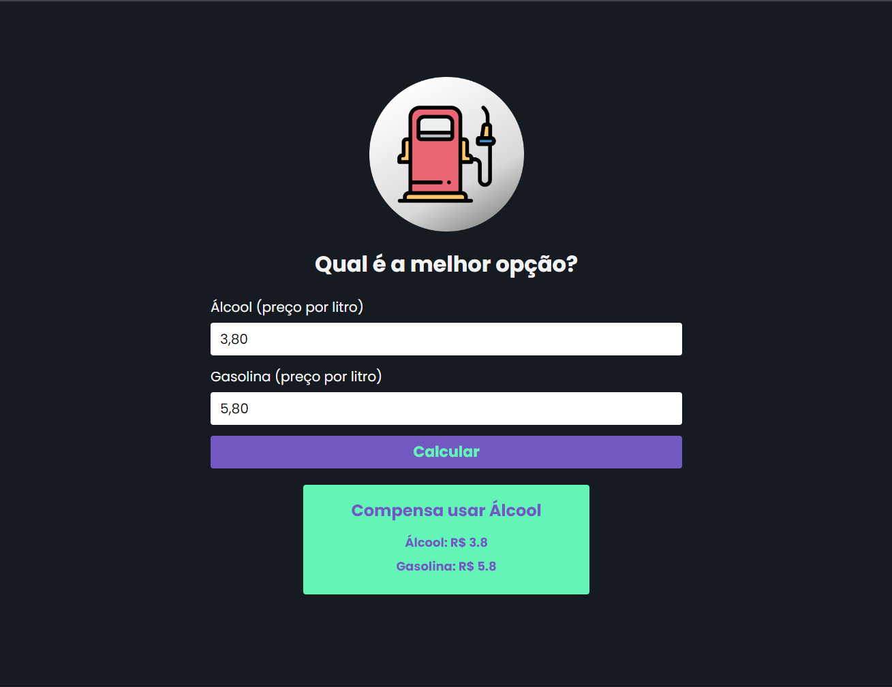

# Projeto Calculadora Álcool/Gasolina

## 📖 Sobre o projeto

Projeto desenvolvido em React com Vite e Typescript. É um projeto simples, que tem como objetivo calcular entre os valores de etanol e gasolina, trazendo como resultado qual combustível tem melhor custo/benefício no momento.

## 💻 Tecnologias utilizadas no projeto

- [React.js](https://reactjs.org) (v18)
- [Vite.js](https://vitejs.dev) (v3)
- [TypeScript](https://www.typescriptlang.org) (v5)
- [ESLint](https://eslint.org)

## 🌿 Branches

- `main` projeto finalizado.

## 🎨 Protótipo do projeto

## 📝 Licença

Este projeto está sob a licença MIT. Consulte a [LICENÇA](./LICENSE) para obter mais informações.


## 🗄️ Estrutura de pastas

O projeto está estruturado da seguinte forma:

- 📁 `public`
- 📁 `src`
  - 📁 `assets`
  - 📁 `components`
  - ⚛️ `App.tsx`

## 🛠️ Instruções de execução

Siga as instruções abaixo para rodar o projeto em seu ambiente local:

```bash

1. Certifique-se de ter o Node.js instalado em seu computador. Você pode baixar a versão mais recente do Node.js em https://nodejs.org.

2. Clone este repositório em seu computador ou faça o download do código fonte.

3. Abra o terminal e navegue até o diretório raiz do projeto.

4. Instale as dependências do projeto executando o seguinte comando:

  npm install

```

5. Após a conclusão da instalação das dependências, inicie o servidor de desenvolvimento local com o comando:

```bash
  npm run dev
```

6. O servidor local será iniciado e você poderá acessar o projeto no seu navegador através do seguinte endereço:

```bash
  http://localhost:5173
```

Caso a porta 5173 estiver em uso, automaticamente o Vite.js irá subir na próxima porta livre da máquina.

Se deseja alterar a porta padrão na qual a aplicação tentará subir, você pode modificar a porta no arquivo `vite.config.js`.

Agora você está pronto para explorar o projeto em seu ambiente local!

<hr>